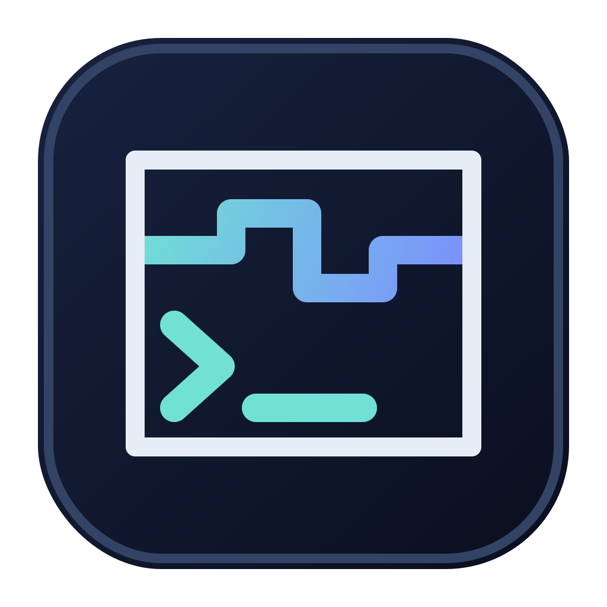
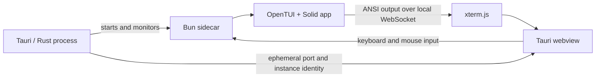

<p align="center">
  
</p>

<h1 align="center">Termweave</h1>

<p align="center">
  A config-driven Tauri + OpenTUI builder for native desktop terminal apps.
</p>

Termweave packages an [OpenTUI](https://github.com/anomalyco/opentui) interface powered by
[Solid](https://www.solidjs.com/) into a native [Tauri](https://tauri.app/) window. The OpenTUI
application runs as a bundled sidecar, streams terminal output over an identity-checked local
WebSocket, and is rendered by [xterm.js](https://github.com/xtermjs/xterm.js) inside the webview.

Use it for terminal-style games, dashboards, focused productivity tools, launchers, and other
keyboard-first desktop applications without making a browser UI imitate a terminal one component
at a time.

## What is included

- OpenTUI + Solid application state in a compiled Bun sidecar.
- A native Tauri 2 window with xterm.js as the terminal renderer.
- A centered, fixed 16:9 terminal canvas that scales with the desktop window.
- A square-cell Kreative Square font and deterministic row/column calculation.
- One JSON file for product metadata, window geometry, colors, diagnostics, and icon source.
- Automatic synchronization of Tauri, Cargo, Bun, HTML, and CSS branding.
- Desktop icon generation from one SVG or PNG source; mobile icon outputs are discarded.
- A native-window startup sequence that avoids the initial white webview flash.
- A centered xterm loading indicator while OpenTUI starts.
- Per-instance sidecar identity, an ephemeral localhost port, handshake validation, and crash
  recovery.
- Optional production diagnostics for investigating bundled-app failures.

Termweave is not a shell or a general-purpose PTY emulator. xterm.js is the display and input
surface for the bundled OpenTUI application.

## Prerequisites

- [Bun](https://bun.sh/)
- A stable Rust toolchain
- The platform dependencies listed in the
  [Tauri 2 prerequisites](https://v2.tauri.app/start/prerequisites/)

On macOS, install Xcode Command Line Tools before building. Windows and Linux require their normal
Tauri/WebView system dependencies.

## Quick start

Install the root and sidecar dependencies:

```sh
bun install
bun install --cwd sidecar
```

Start the desktop application:

```sh
bun run app:dev
```

Create a production bundle for the current host platform:

```sh
bun run app:build
```

Both commands begin with `bun run app:check`, which type-checks the root and sidecar TypeScript
projects and then formats both with Prettier. If either type-check fails, development or building
stops before icons, configuration, sidecar binaries, or native bundles are generated.

The release bundles are written under `src-tauri/target/release/bundle/`.

## Create your application

Most applications only need changes in three places:

1. Edit `app.config.json` for product metadata, window size, terminal grid, and base colors.
2. Replace `app-icon.svg` with one SVG or PNG source icon and update `icon` if its path changes.
3. Replace the welcome interface in `sidecar/src/App.tsx` and add application modules under
   `sidecar/src/`.

Then run:

```sh
bun run app:dev
```

The development command already includes `app:check`; run `bun run app:check` separately only when
you want to validate and format the projects without starting the application.

Keep the bridge in `sidecar/src/index.tsx` and the webview code in `src/` unchanged unless you are
extending the transport or desktop shell itself.

## Application configuration

`app.config.json` is the source of truth:

```json
{
  "name": "Termweave",
  "description": "A config-driven Tauri and OpenTUI builder for native desktop terminal apps.",
  "packageName": "termweave",
  "bundleIdentifier": "com.nikdelvin.termweave",
  "version": "0.1.0",
  "authors": ["Nik Delvin"],
  "windowWidth": 1920,
  "windowHeight": 1080,
  "fontSize": 10,
  "showDiagnostics": false,
  "themeColor": "#0B1020",
  "foregroundColor": "#E6EDF7",
  "icon": "app-icon.svg"
}
```

| Field                          | Purpose                                                                           |
| ------------------------------ | --------------------------------------------------------------------------------- |
| `name`                         | Native product name, window title, HTML title, and accessible terminal label.     |
| `description`                  | Root package and Cargo package description.                                       |
| `packageName`                  | Lowercase kebab-case Bun package and Rust package name.                           |
| `bundleIdentifier`             | Reverse-domain Tauri bundle identifier and sidecar protocol namespace.            |
| `version`                      | Semantic version synchronized across Bun, Cargo, and Tauri.                       |
| `authors`                      | Cargo package authors.                                                            |
| `windowWidth` / `windowHeight` | Reference design resolution and initial native window size. Must be exactly 16:9. |
| `fontSize`                     | Reference square cell size used to derive terminal columns and rows.              |
| `showDiagnostics`              | Shows the production diagnostics panel when `true`. Keep `false` for releases.    |
| `themeColor`                   | Background for the native window, webview, xterm.js, and OpenTUI.                 |
| `foregroundColor`              | Default xterm.js/OpenTUI text, cursor, and loading indicator color.               |
| `icon`                         | Root-relative source SVG or PNG used to generate desktop bundle icons.            |

The terminal grid is calculated as:

```text
columns = windowWidth / fontSize
rows    = windowHeight / fontSize
```

Both results must be integers or configuration synchronization stops with an error. The default
`1920 × 1080` design at `10px` produces a `192 × 108` grid. The bundled square font is deliberately
not configurable because a different font can break cell geometry.

The actual xterm font size is recalculated when the native window changes size. The terminal keeps
its configured grid, remains centered, and fits inside the largest available 16:9 area; the app is
not forced to stay fullscreen.

## Generated branding

Run `bun run config:sync` after changing `app.config.json`. The `app:dev`, `app:build`, `dev`, and
`build` scripts already do this automatically.

The synchronization script updates:

- `src-tauri/tauri.conf.json`
- `src-tauri/Cargo.toml`
- `src-tauri/src/main.rs`
- `package.json`
- the root workspace entry in `bun.lock`
- `index.html`
- the generated theme variables in `src/styles.css`

Do not hand-edit synchronized branding values in those files. Change `app.config.json` instead.

`bun run icons:generate` creates the macOS, Windows, and Linux icon files under
`src-tauri/icons/`. Generated icons and host-specific sidecar binaries are ignored by Git and are
rebuilt by the application scripts.

## Architecture



At startup, Tauri allocates an unused localhost port and a unique instance ID. The webview passes
both values to the sidecar process. Before any terminal data is accepted, the sidecar must identify
itself with the expected protocol, instance ID, and port. If the sidecar exits unexpectedly, the
webview first attempts to reconnect and then starts a replacement process.

The native window stays hidden until the page background, bundled font, xterm.js, and loading frame
are ready. This avoids a white startup flash while still providing immediate feedback before the
first OpenTUI frame arrives.

## Project layout

```text
app.config.json            Product and rendering configuration
app-icon.svg               Single source icon
scripts/                   Config synchronization and icon generation
shared/                    Config values shared by webview and sidecar
sidecar/src/App.tsx        Your OpenTUI + Solid application
sidecar/src/index.tsx      Terminal/WebSocket bridge
sidecar/scripts/build.ts   Host-specific sidecar compiler
src/                       xterm.js webview and diagnostics
src-tauri/                 Native Tauri shell and bundle configuration
```

## Scripts

| Command                  | Purpose                                                                            |
| ------------------------ | ---------------------------------------------------------------------------------- |
| `bun run app:dev`        | Run `app:check`, prepare assets/config/sidecar, and start Tauri dev.                |
| `bun run app:build`      | Run `app:check`, prepare assets/config/sidecar, and build native bundles.           |
| `bun run app:check`      | Type-check both TypeScript projects and format both with Prettier.                 |
| `bun run config:sync`    | Validate `app.config.json` and synchronize generated branding.                     |
| `bun run icons:generate` | Generate desktop icons from the configured source icon.                            |
| `bun run sidecar:build`  | Compile OpenTUI into the host-specific Tauri sidecar binary.                       |
| `bun run dev`            | Run only the Vite webview development server.                                      |
| `bun run build`          | Type-check and build only the Vite webview assets.                                 |

## Platform notes

- Termweave builder has been exercised only on macOS. Tauri targets macOS, Windows, and Linux, but installers
  should be validated and signed on every platform you plan to release.
- The sidecar build uses `rustc --print host-tuple`, so it produces a binary for the current host.
  Cross-compilation is not configured.
- Mobile targets are intentionally out of scope; the icon script removes Android and iOS outputs.
- The local WebSocket is an internal transport, not a network API. Do not bind it to a public
  interface without adding an appropriate security model.

## License

[MIT](./LICENSE)
