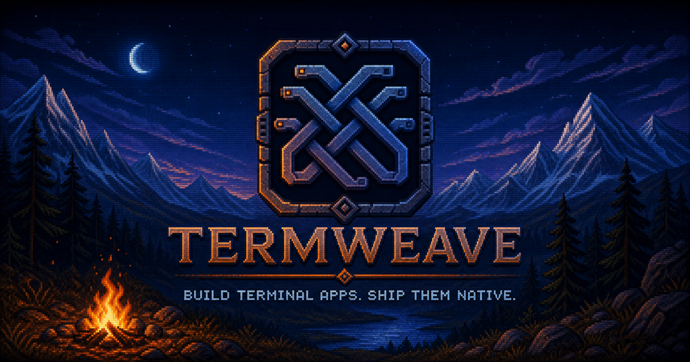

<div align="center">
  
</div>

<p align="center">
  
</p>

📟 **Termweave** turns an [OpenTUI](https://github.com/anomalyco/opentui) interface into a native
[Tauri](https://tauri.app/) desktop app.

You build the interface with
[Solid](https://www.solidjs.com/) — Termweave handles everything else:<br>
📦 The window, terminal renderer, app lifecycle,
and native packaging.

## ✨ Why Termweave?

- Build with OpenTUI and Solid instead of recreating a terminal UI in the browser.
- Run your app in a native, resizable Tauri window.
- Configure the name, colors, window size, and icon in ⚙️ **one config file**.
- See source changes without restarting the native window.
- Create a native bundle with ⚡️ **one command**.

## 🚀 Quick start

You need macOS, [Bun 1.3+](https://bun.sh/), a stable
[Rust toolchain](https://www.rust-lang.org/tools/install), and the Xcode Command Line Tools.

Create an empty project and run the installer:

```sh
mkdir my-termweave-app
cd my-termweave-app
curl -fsSLo install.sh https://raw.githubusercontent.com/nikdelvin/termweave/main/sdk/install.sh
sh install.sh
```

The installer asks for your app name and metadata, creates the starter project, and installs its
dependencies.

Start the app:

```sh
bun run dev
```

## 🎨 Make it yours

The main places to edit are:

1. `src/routes/` — build the starter Home and Demo screens.
2. `src/routes.ts` and `src/App.tsx` — configure routing and the application shell.
3. `app.config.json` — set the app name, colors, window size, and bundle metadata.
4. `app.icon.png` — replace the default app icon.

Changes under `src/` reload while the app is running. Restart `bun run dev` after changing the
configuration or icon.

### Pixel graphics

`PixelRenderer` is included with the managed SDK. Keep the image in your project and import the
component directly—there is no component file to copy:

```tsx
import { PixelRenderer } from "@termweave/sdk";
import background from "./assets/background.jpg" with { type: "file" };

export function App() {
  return (
    <PixelRenderer uri={background}>
      <box position="absolute" bottom={0} width="100%" height={8}>
        <text>Overlay content</text>
      </box>
    </PixelRenderer>
  );
}
```

`PixelRenderer` accepts GIF, PNG and JPEG/JPG images from bundled project assets, local file paths
and URLs. Animated GIFs play at 150 milliseconds per frame.

Routes declare their direct `connections` in `src/routes.ts`. The starter preloads only those
one-hop route images in the background and replaces the retained preload set after navigation, so
large route graphs do not load every image at startup.

Your project stays small:

```text
my-termweave-app/
├── src/
│   ├── App.tsx
│   ├── routes.ts
│   ├── routes/
│   │   ├── HomeRoute.tsx
│   │   └── DemoRoute.tsx
│   ├── components/
│   └── assets/
├── app.config.json
├── app.icon.png
├── package.json
├── patches/        Router compatibility patch
└── termweave/       Managed SDK checkout
```

## 🧰 Commands

| Command          | What it does                                     |
| ---------------- | ------------------------------------------------ |
| `bun run dev`    | Check the project and start the desktop app.     |
| `bun run build`  | Build native bundles into `build/`.              |
| `bun run check`  | Run linting, type checks, and formatting checks. |
| `bun run update` | Update the managed SDK to the latest `main`.     |

## 🍎 Current status

Termweave currently supports macOS for installation and development. Native bundles are built for
the current machine.

## 🤝 Contributing

Issues and pull requests are welcome. Read [CONTRIBUTING.md](./CONTRIBUTING.md) to get started.

Termweave is available under the [MIT License](./LICENSE).

⭐ If Termweave helps you build something,
[star the repository](https://github.com/nikdelvin/termweave) and share what you made.
