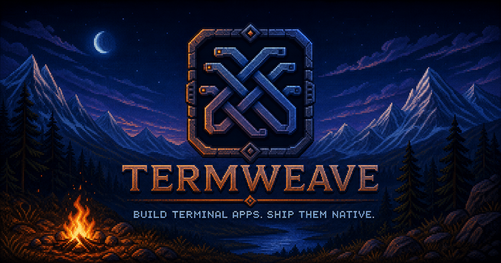

<div align="center">
  
</div>

# Termweave

Termweave turns an [OpenTUI](https://github.com/anomalyco/opentui) and
[Solid](https://www.solidjs.com/) interface into a native
[Tauri](https://tauri.app/) desktop application. The v2 template lives in [`sdk-v2/`](./sdk-v2/)
and supports macOS on Apple Silicon and Intel.

The terminal is presented on a fixed 2560×1440, 128×72 grid inside an always-on monitor and CRT
effect. Application authors own `app/`, application metadata, the theme color, and the icon;
Termweave owns the renderer, transport, presentation, and packaging implementation.

## Quick start

You need macOS, Bun 1.3+, a stable Rust toolchain, and the Xcode Command Line Tools.

```sh
git clone https://github.com/nikdelvin/termweave.git
cd termweave/sdk-v2
bun install
bun run dev
```

Start by editing:

- `app.config.json` and `app.icon.png`
- `app/store.ts` for durable application state and actions
- `app/screens.ts`
- `app/screens/`, `app/components/`, and `app/assets/`
- `app/App.tsx` when changing global keyboard navigation

See the [v2 template guide](./sdk-v2/README.md) for the ownership map, configuration schema, public
API, and command reference.

## Commands

Run these from `sdk-v2/`:

| Command         | Purpose                                                        |
| --------------- | -------------------------------------------------------------- |
| `bun run dev`   | Prepare generated native inputs and start the development app. |
| `bun run test`  | Run the behavior and boundary test suite.                      |
| `bun run check` | Run tests, type checking, lint, formatting, and Rust checks.   |
| `bun run build` | Validate and create a native macOS bundle.                     |

## Repository generations

`sdk-v2/` is the current implementation. `sdk/` is retained unchanged as the v1 reference and is
not part of v2 development or synchronization.

Issues and pull requests are welcome. Read [CONTRIBUTING.md](./CONTRIBUTING.md) before contributing.
Termweave is available under the [MIT License](./LICENSE).
